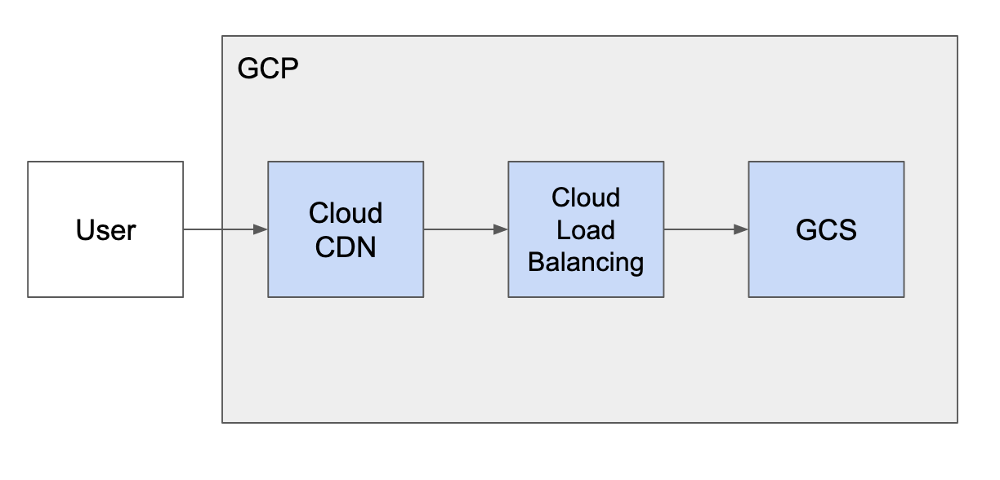
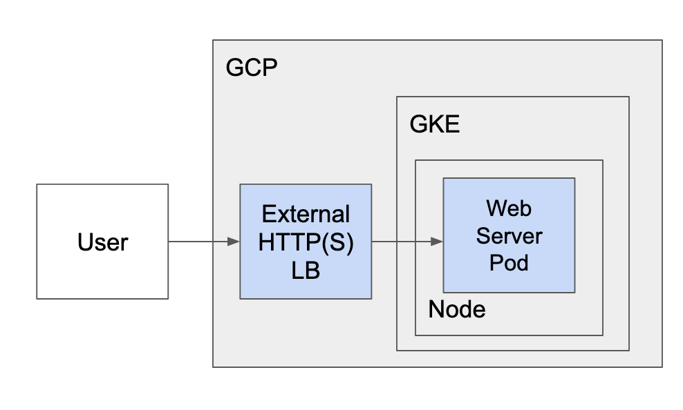

# Approach Taken

## What principles did you apply?

My driving principle was: get a solution out, while making minimal assumptions, to enable the team to start validating their product. Then, with a initial solution, work with the developers to get more insights into their requirements and share recommendations with them.

## Explanation of the decisions you made and why

Many explanations are inline with the source and covered below.

## What end state do you envision (if you run out of time to implement)?

I'll touch on some of potential end states in `What is your recommendation for future work if time allows?`, but I would say that there is a lot of opportunity for management (ex: IAM access control) and security improvements (SA for GKE, SA for writing to bucket, private GKE cluster) based on the company's needs and wants.

## Why were certain tools selected?

### Terraform

Required by challenge and a best practice for managing infrastructure.

### GKE

Relevant to role and enables us to host and scale the WAR web server.

### Static Assets

* Store static assets in GCS
  * Why?
    * Cost - As opposed to other storage options
    * Ease - `gsutil`
    * Flexibility - flexibility with organization 
* Serve static assets via LoadBalancer fronted by CDN
  * Why?
    * While not `a web server`, this does solve the problem of serving the assets, without the overhead of having to manage a web server
    * The CDN helps manage the network traffic and delivery assets quicker to customers

### Web Server

*Grossly over simplified and not extensive*

* Run WAR file in tomcat helm
  * Why
    * I originally was going to build a Docker image, write a Helm chart, and deploy the WAR asset. However, this helm chart solved the initial problem of hosting the WAR and has been tested by others, so it should prove more reliable
* Run tomcat on GKE
  * Why
    * Able to scale and configure load balancer, replication, and persistent volume
* Store WAR on GCE persistent volume
  * Why
    * Persists between deploys
    * Ease
    * Cost
    * Prevaylor volume can only be written to by one instance of the WAR
* Persist prevaylor on GCE persistent volume
  * Why 
    * Pods are ephemeral
    * Persists prevaylor file between pod restarts
* Run GKE with one one node and zone
  * Why 
    * Limited release
    * (Personal) Cost
    * prevaylor volume can only be written to by one pod (so more nodes would be a waste)

## Why you configured the tools as you did? 

Many explanations are inline with the source. In short, I configured many of the tools to be cheap (avoid personal expenses), and put the hooks in place to scale or modify the infrastructure after some improvement/scaling ideas were discussed with the development team.

## What is your recommendation for future work if time allows?

For organizational purposes, I'll break the improvement recommendations into a few high-level categories.

### Terraform project

The terraform project in its current state is prone to errors and potential data loss. A few small improvements could be made to address these:
* Store terraform state in [GCS](https://www.terraform.io/docs/language/settings/backends/gcs.html) or use a tool such as TFE. This will allow other developers to manage the terraform environment and help avoid data loss.
* The project should have a basic CI to validate branches by at least testing formatting and planning, and deploy to environments
* The `./terraform` should likely be in its own repo and at the root of the project
* tfvars should be moved to a tool like TFE, Vault, or in CI secrets. They can be included in the source, but we should be mindful that they shouldn't include secrets then.
* `description`s for all output and variables

### Infrastructure

(The resources created with terraform)

* Add IAM support to onboard and manage new users
* Support HTTPS at the load balancers for increased security

### GKE

* Use a non-default namespace for companyNews to help mitigate risk of challenges that may arise later if we decide to have a multi-tenancy GKE cluster
* Make GKE private. This should be a discussion with the stakeholders to understand their tolerance for risk
  * Pros
    * Reduce attack vector
    * Avoid public ips
  * Cons
    * Requires a NAT (can use Cloud NAT)
    * Can complicate accessing nodes
* More discussed in [Scaling](scaling.md)
* Adjust subnet and secondary ranges based on projected number of pods and services
* Use [terraform-google-kubernetes-engine](https://github.com/terraform-google-modules/terraform-google-kubernetes-engine) to help simplify our GKE resources and apply best practices (didn't implement in the solution because of wanting to avoid unnecessary providers)
* The primary node pool configuration should be updated to support autoscaling to a reasonable maximum (based on cost, quotas, etc)

### Static Assets

* Review caching behavior with the development team. We don't want assets not being updated on clients deviced because the cache is misconfigured
* Create Service Account with write permissions to CDN bucket. A key for this SA could be given to the devleopment team, so they could deploy the assets from their CI
* The asset and web server deploy is not an atomic operation. We could deploy assets to different paths in a bucket and point to said paths from the newly released web server
* Use Cloud DNS to resolve IP

### Web Server

* Containerize (Docker image) WAR with tomcat, publish to GCR, and deploy helm specific for companyNews
  * Deploying an asset via `kubectl cp` is a terrible practice
  * The WAR could be bundled in a Docker image via the development teams CI (this would require setting up GCR and giving them a SA with write permissions)
  * This would enable rolling updates and roll backs with Kubernetes by tagging images and updating rollout strategy
  * We could potentially slim down and better protect the web server with customizations
  * I started containerizing an example WAR in [/tests/assets/war/](/tests/assets/war/README.md)
* Deployment healthcheck specific to WAR
  * Currently the web server deployment does check the health of the WAR. This could lead to the pod looking healthy, when infact the deployment is broken
* Move from prevayler to data storage option appropriate for companyNews use case
  * Discussed in [Scaling](./scaling.md)
  * Use Cloud DNS to resolve IP